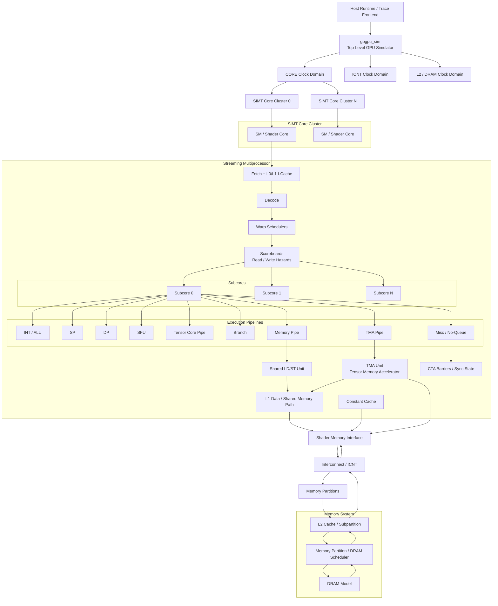

# Nvidia GPU Architectural Block Diagram — 2026-06-17

## Simulator-Oriented Architecture

This diagram reflects the Nvidia GPU architecture modeled by this repository.
It is based on the simulator's own block structure: `gpgpu_sim`, SIMT clusters,
SMs, subcores, functional-unit pipelines, memory hierarchy, interconnect, L2,
DRAM, tensor pipelines, and TMA units.

## Performance-Critical Parameter Taxonomy

The items below are ordered by typical impact on kernel runtime. The exact order
is workload-dependent: compute-bound, memory-bound, tensor-bound, and
synchronization-bound kernels will stress different parts of the diagram. Repo
names are used where the simulator exposes a concrete parameter, class, or
modeled structure.

| Priority | Big-Ticket Item | Diagram Blocks | Why It Matters | Repo-Defined Parameters |
|---:|---|---|---|---|
| 1 | **Occupancy and SM residency** | `gpgpu_sim`, SIMT clusters, SM, subcores | Determines how many warps and CTAs can be resident, which controls latency hiding and total parallel work in flight. | `shader_core_config::n_simt_clusters` `shader_core_config::n_simt_cores_per_cluster` `gpgpu_sim_config::num_shader()` `shader_core_config::n_thread_per_shader` `shader_core_config::warp_size` `shader_core_config::max_warps_per_shader` `shader_core_config::max_cta_per_core` `shader_core_config::gpgpu_shader_registers` `shader_core_config::gpgpu_shmem_size` `shader_core_config::gpgpu_shmem_per_block` |
| 2 | **Issue, scheduling, and execution throughput** | Warp schedulers, scoreboards, subcores, execution pipelines | Defines the compute roofline: how many instructions can issue, which pipelines can dual-issue, and how fast ALU/SFU/DP pipelines accept dependent and independent work. | `shader_core_config::num_subcores_in_SM` `shader_core_config::gpgpu_num_sched_per_core` `shader_core_config::gpgpu_scheduler_string` `shader_core_config::gpgpu_max_insn_issue_per_warp` `shader_core_config::gpgpu_dual_issue_diff_exec_units` `shader_core_config::pipeline_widths_string` `shader_core_config::pipe_widths` `gpgpu_num_sp_units` `gpgpu_num_dp_units` `gpgpu_num_int_units` `gpgpu_num_sfu_units` `shader_core_config::max_sp_latency` `shader_core_config::max_int_latency` `shader_core_config::max_sfu_latency` `shader_core_config::max_dp_latency` |
| 3 | **Register file and operand delivery** | Schedulers, scoreboards, execution pipelines | A kernel can be pipeline-rich but operand-starved. Register banks, ports, collector units, and register latency affect bank conflicts, dependency stalls, and achieved issue rate. | `shader_core_config::gpgpu_num_reg_banks` `shader_core_config::reg_file_port_throughput` `gpgpu_reg_bank_use_warp_id` `num_regular_register_file_read_ports_per_bank` `num_regular_register_file_write_ports_per_bank` `max_latency_regular_register_file_latency` `gpgpu_operand_collector_num_units_*` `gpgpu_operand_collector_num_in_ports_*` `gpgpu_operand_collector_num_out_ports_*` |
| 4 | **Shared memory, L1, and SM memory pipeline** | LD/ST unit, L1 data / shared memory path, shader memory interface | Controls latency and bandwidth for on-chip data movement. Bank conflicts, coalescing, queue limits, and L1 lookup bandwidth often decide whether a kernel reaches its compute roofline. | `shader_core_config::gpgpu_shmem_num_banks` `gpgpu_shmem_limited_broadcast` `gpgpu_shmem_warp_parts` `gpgpu_smem_latency` `memory_shared_memory_minimum_latency` `memory_l1d_minimum_latency` `memory_l1d_max_lookups_per_cycle_per_bank` `memory_maximum_coalescing_cycles` `memory_subcore_link_to_sm_byte_size` `memmory_max_concurrent_requests_shmem_per_sm` `memmory_max_concurrent_requests_standard_per_sm` `m_L1D_config` `l1d_cache_config::l1_latency` `l1d_cache_config::l1_banks` |
| 5 | **L2, DRAM, and global memory service** | Interconnect, memory partitions, L2, DRAM scheduler, DRAM model | Dominates memory-bound kernels. Cache geometry, memory partition count, bus width, burst length, DRAM timing, and scheduler policy determine global-memory latency and sustained bandwidth. | `memory_config::m_L2_config` `gpgpu_cache:dl2` `gpgpu_l2_rop_latency` `memory_config::m_n_mem` `memory_config::m_n_sub_partition_per_memory_channel` `gpgpu_n_mem_per_ctrlr` `memory_config::scheduler_type` `gpgpu_dram_partition_queues` `gpgpu_frfcfs_dram_sched_queue_size` `gpgpu_dram_return_queue_size` `memory_config::busW` `memory_config::BL` `memory_config::nbk` `memory_config::nbkgrp` `memory_config::tCCD` `memory_config::tRCD` `memory_config::tRAS` `memory_config::tRP` `memory_config::CL` `memory_config::WL` `dram_latency` `dram_data_command_freq_ratio` |
| 6 | **Tensor and matrix engine throughput** | Tensor core pipe, subcores, schedulers | Dominates GEMM, convolution, attention, and other matrix-heavy kernels. Tensor latency, unit count, issue rate, and shape-specific extra latency set the tensor roofline. | `gpgpu_tensor_core_avail` `gpgpu_num_tensor_core_units` `tensor_latency` `tensor_rate_per_cycle` `shader_core_config::max_tensor_core_latency` `tensor_extra_latency_16816_fp32_1688_fp32` |
| 7 | **TMA / async copy / DMA behavior** | TMA pipe, TMA unit, L1/shared path, shader memory interface | Controls producer/consumer kernels that overlap global-to-shared movement with compute. Queue depth, request rate, transfer state, and outstanding limits decide whether copy engines hide memory latency. | `tma_unit_sm::kMaxRequestsPerCycle` `TMACommand` `TMATransferEntry` `TMAOpcodeFamily` `TMADirection` `TMATransferType` `TMAOperandForm` `m_command_queue` `m_in_flight_transfers` `m_outstanding_requests` `m_outstanding_stores_per_warp` `Subcore::m_tma_pipeline` `SM::m_tma_unit_shared_of_sm` `m_EX_TMA_reception_latches_per_subcore` |
| 8 | **Synchronization, fences, and barrier progress** | Barriers / sync state, misc pipeline, TMA completion path | Barrier and fence costs directly affect tiled kernels, reductions, cluster-scope communication, and async-copy completion. Incorrect readiness modeling can create large performance or progress errors. | `gpgpu_num_cta_barriers` `BARRIER_OP` `MEMORY_BARRIER_OP` `GRID_BARRIER_OP` `MBARRIER_OP` `CLUSTER_BARRIER_OP` `sync_debug_enable` `sync_debug_print_budget` `sync_debug_skip_runtime_budget` |
| 9 | **Interconnect and address mapping** | Shader memory interface, ICNT, memory partitions | Determines how SM requests reach L2/DRAM partitions. Address mapping and ICNT latency/bandwidth can create partition camping, congestion, and backpressure. | `icnt_flit_size` `gpgpu_mem_addr_mapping` `gpgpu_mem_address_mask` `routing_delay` `vc_alloc_delay` `sw_alloc_delay` `credit_delay` `input_speedup` `output_speedup` `internal_speedup` |
| 10 | **Instruction, constant, texture, and cache policy details** | Fetch, L0/L1 instruction cache, constant cache, texture cache | Usually secondary for dense compute kernels, but important for large instruction footprints, lookup-heavy kernels, texture paths, and constant-cache broadcast behavior. | `m_L1I_L1_half_C_cache_config` `m_L0I_config` `m_L1C_config` `m_L0C_config` `m_L1T_config` `cache_config::m_nset` `cache_config::m_line_sz` `cache_config::m_assoc` `cache_config::m_mshr_entries` `cache_config::m_mshr_max_merge` `cache_config::m_miss_queue_size` |

## Parameter Impact Notes

Occupancy parameters define how much latency the machine can hide. Scheduler and
pipeline parameters define the compute roofline once enough warps are resident.
Register, shared-memory, and cache parameters often decide whether a kernel can
actually reach that roofline.

For memory-bound kernels, L2, DRAM, interconnect, coalescing, and address-mapping
parameters dominate. For modern GEMM, attention, and producer/consumer kernels,
tensor throughput, TMA / async-copy behavior, and synchronization progress become
first-order performance terms.

## Repo Mapping

| Architectural Block | Repo Location |
|---|---|
| GPU top-level simulator | `simulator-remodeled/gpu-simulator/gpgpu-sim/src/gpgpu-sim/gpu-sim.h`, `gpu-sim.cc` |
| SIMT clusters | `simulator-remodeled/gpu-simulator/gpgpu-sim/src/gpgpu-sim/shader.h`, `shader.cc` |
| Remodeled SM | `simulator-remodeled/gpu-simulator/gpgpu-sim/src/gpgpu-sim/remodeling/sm.h`, `sm.cc` |
| Subcores and issue pipeline | `simulator-remodeled/gpu-simulator/gpgpu-sim/src/gpgpu-sim/remodeling/subcore.h`, `subcore.cc` |
| Functional units | `simulator-remodeled/gpu-simulator/gpgpu-sim/src/gpgpu-sim/remodeling/functional_unit.cc` |
| Operation types and warp instructions | `simulator-remodeled/gpu-simulator/gpgpu-sim/src/operation_type.h`, `abstract_hardware_model.h` |
| LD/ST unit | `simulator-remodeled/gpu-simulator/gpgpu-sim/src/gpgpu-sim/remodeling/ldst_unit_sm.h`, `ldst_unit_sm.cc` |
| TMA unit | `simulator-remodeled/gpu-simulator/gpgpu-sim/src/gpgpu-sim/remodeling/tma_unit_sm.h`, `tma_unit_sm.cc` |
| Interconnect | `simulator-remodeled/gpu-simulator/gpgpu-sim/src/gpgpu-sim/icnt_wrapper.h`, `icnt_wrapper.cc`, `local_interconnect.h`, `intersim2/` |
| L2 and cache model | `simulator-remodeled/gpu-simulator/gpgpu-sim/src/gpgpu-sim/l2cache.h`, `l2cache.cc`, `gpu-cache.h`, `gpu-cache.cc` |
| DRAM model | `simulator-remodeled/gpu-simulator/gpgpu-sim/src/gpgpu-sim/dram.h`, `dram.cc` |

## Interpretation Notes

This is a simulator-oriented architectural diagram, not a transistor-accurate
Nvidia product floorplan. The diagram emphasizes the components represented in
the repo and the paths exercised by the timing model.
