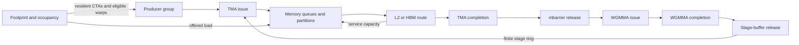

# Request: Own CUDA-Event and Mechanism Measurement for JIT Kernels

To: AMORA maintainers
Status: Requested
Date: 2026-08-31 17:19 -0700
Consumer: `/home/cliu/wk/accorde`

## User Prompts, Verbatim

> how to address "NCU replay perturbs duration; it is not the latency oracle.", can we just use CUDA events?
> justify the introduction of fixed wait latency. How can this be fixed? 
> justify the duration- or working-set-dependent completion law? How's that physically related?
> It's not just fitting, it should be physically explainable.

> shouldn't the measurement be done by amora?

> also, by "physical meaning", I mean we can't just fitting the numbers, which is a number game. We should work on the underlying interlinked bottlenecks.

## Revision History

| Revision | Timestamp | Change |
|---|---|---|
| r2 | 2026-08-31 17:22 -0700 | Required Amora evidence to identify a coupled resource-and-dependency system rather than independent fitted corrections, including synchronized measurements of occupancy, offered load, route traffic, queue pressure, waits, and release events. |
| r1 | 2026-08-31 17:19 -0700 | Requested an Amora-owned measurement contract that separates unprofiled CUDA-event timing, optional device-side intervals, and NCU mechanism evidence for arbitrary JIT target commands. |

## Decision Requested

Yes: Amora should own measurement orchestration, evidence schemas, repetition,
provenance, and validation.

Accorde should provide only:

- a target command that compiles and launches a Gluon subject;
- a machine-readable CUDA-event payload emitted by that target, because CUDA
  events must be recorded in the process that owns the CUDA stream;
- optional device-side `%globaltimer` intervals emitted by an instrumented
  variant; and
- the P³ model and interpretation applied after Amora returns evidence.

Amora should own:

- process-isolated timing repetitions;
- validation of the CUDA-event payload;
- cache-state, launch-batching, GPU, and clock-policy provenance;
- aggregate NCU collection;
- SourceCounters and PC-to-SASS evidence;
- memory-route and traffic counters;
- identity checks across timing and profiling lanes;
- immutable run directories and manifests; and
- explicit prevention of NCU replay duration becoming the latency label.

## Coupled-Bottleneck Requirement

The requested evidence must support a single causal event/resource graph, not a
table of independent correlations:



Amora should preserve enough same-case evidence to determine which edge became
binding when one intervention changes:

- compiled queue/stage capacity;
- resident CTAs and warps;
- request bytes and request count;
- route-specific bytes/sectors;
- cache/reuse protocol;
- issue-to-completion interval;
- barrier-release interval;
- matrix completion interval; and
- total unprofiled CUDA-event latency.

Do not expose a recommendation such as “add `a + b*K`” or “add a working-set
penalty.” `K`, elapsed duration, and working-set size are interventions. Their
effects must be mediated by measurable route, service, queue, occupancy, and
dependency state.

## Why CUDA Events Still Need an In-Process Adapter

A parent process cannot place CUDA events around work submitted to a child
process's CUDA stream. Therefore an arbitrary-command timing API requires a
small target-side protocol:

1. the target creates CUDA events on the stream that launches the kernel;
2. the target emits a JSON result;
3. Amora executes the target repeatedly, validates the JSON, and owns the
   resulting measurement record.

This does not move measurement ownership to Accorde. It is analogous to a
benchmark driver printing a result while the benchmark framework owns the run
protocol and evidence.

## Requested API 1: Target-Command CUDA-Event Timing

Add a reusable module such as:

`amora/backends/nvidia/cuda_event_run.py`

Suggested result contract:

```python
@dataclass(frozen=True)
class CudaEventTimingResult:
    target_command: tuple[str, ...]
    process_samples: tuple["CudaEventProcessSample", ...]
    median_us: float
    p05_us: float
    p95_us: float
    process_cv: float
    launch_batch_size: int
    cache_protocol: str
    device: Mapping[str, str]
    subject_identity: Mapping[str, str]
    provenance: Mapping[str, object]
```

Suggested API:

```python
def run_command_cuda_events(
    target: tuple[str, ...],
    *,
    repeats: int = 7,
    timeout: int = 180,
    expected_launch_batch_size: int | None = None,
    expected_cache_protocol: str | None = None,
    required_identity_fields: tuple[str, ...] = (
        "ttgir_sha256",
        "cubin_sha256",
    ),
) -> CudaEventTimingResult:
    ...
```

The target's final stdout line should be one JSON document:

```json
{
  "schema_version": 1,
  "kind": "cuda_event_timing",
  "timing": {
    "unit": "us_per_launch",
    "samples": [21.31, 21.29, 21.35],
    "warmup_launches": 20,
    "launches_per_sample": 100,
    "cache_protocol": "warm_reuse"
  },
  "device": {
    "uuid": "GPU-...",
    "name": "NVIDIA H100 80GB HBM3",
    "sm_clock_mhz": "..."
  },
  "subject_identity": {
    "kernel_name": "...",
    "ttgir_sha256": "...",
    "cubin_sha256": "..."
  }
}
```

Amora should reject:

- empty or non-finite samples;
- non-positive durations;
- identity changes across process repeats;
- unexpected batching or cache protocol;
- GPU UUID changes;
- nonzero process return codes; and
- mixed units.

The result should retain every process-level sample set rather than only the
pooled median.

## Requested API 2: Measurement-Bundle Orchestration

Add an orchestration helper that runs independent evidence lanes:

```python
def collect_command_measurement_bundle(
    *,
    timing_target: tuple[str, ...],
    ncu_target: tuple[str, ...],
    capabilities: NvidiaCapabilities,
    aggregate_metrics: tuple[str, ...],
    kernel_name: str,
    cache_control: str,
    repeats: int = 7,
    collect_pc_sampling: bool = True,
) -> CommandMeasurementBundle:
    ...
```

The lanes are:

1. **Unprofiled timing**
   - target-emitted CUDA events;
   - primary latency label.
2. **Optional device intervals**
   - target-emitted `%globaltimer` intervals;
   - diagnostic issue-to-wait and wait-to-release intervals.
3. **NCU aggregate and SourceCounters**
   - reason, traffic, route, and PC/SASS evidence;
   - never the primary latency label.

The bundle must verify identical subject identity across lanes. If the target
commands produce different TTGIR or cubin hashes, mark the comparison invalid.

Suggested bundle fields:

```json
{
  "latency_oracle": "cuda_events",
  "ncu_duration_role": "diagnostic_profiler_perturbation_only",
  "timing": {},
  "device_intervals": {},
  "aggregate_counters": {},
  "pc_sampling": {},
  "identity_check": {
    "status": "pass",
    "ttgir_sha256": "...",
    "cubin_sha256": "..."
  }
}
```

## Requested API 3: Cache-Control Support

Add `cache_control` to:

- `run_command_profiled`;
- `run_command_pc_sampling`;
- `run_kernel_profiled`; and
- `run_kernel_pc_sampling`.

Accepted values should match NCU's supported values and be recorded in
provenance. This removes the Accorde-local NCU wrapper currently used only to
inject `--cache-control none`.

The CUDA-event lane needs its own semantic cache protocol:

- `warm_reuse`: warm and repeatedly launch the same operand addresses;
- `disjoint_rotation`: rotate through disjoint allocations between samples;
- `cold_flush`: run an explicit cache-thrashing preparation outside the timed
  interval.

Do not equate NCU `--cache-control` with the CUDA-event cache protocol without
validation. They are different mechanisms.

## Requested API 4: Device-Interval Payload

Amora need not generate Gluon `%globaltimer` code. It should define and validate
the output contract for a target that does:

```json
{
  "kind": "cuda_device_intervals",
  "clock": "globaltimer_ns",
  "intervals": [
    {
      "name": "wgmma_exposed_wait",
      "start_ns": 1000,
      "end_ns": 1120,
      "duration_ns": 120
    }
  ],
  "instrumentation": {
    "unprofiled_event_overhead_percent": 1.4,
    "sass_bracketing_verified": true
  }
}
```

Amora should mark interval evidence diagnostic when:

- SASS bracketing is not verified;
- timestamps are not monotonic;
- the instrumented kernel changes the target instruction sequence;
- instrumentation changes unprofiled CUDA-event latency or slope beyond a
  declared threshold; or
- the clock source is not documented.

## Requested API 5: Physical Mechanism Evidence

Support one command-target collection recipe for the proposed isolated probes.

### WGMMA Fixed-Completion Probe

Measurement axes:

- WGMMA repeats;
- independent register-work gap;
- allowed outstanding WGMMA groups;
- instruction shape;
- one-CTA and one-CTA-per-SM load.

Evidence:

- CUDA-event total latency;
- optional `%globaltimer` wait interval;
- `wait`, `math_pipe_throttle`, `barrier`, and `warpgroup_arrive`;
- SourceCounters joined to WGMMA and dependent-consumer PCs;
- exact TTGIR/PTX/SASS/cubin identity;
- register, shared-memory, and spill metadata.

Physical test:

```text
exposed_wait(D) = max(0, L_complete - D)
```

Amora should collect the evidence needed to accept or reject the knee. Accorde
will decide whether `L_complete` belongs in the P³ architecture contract.

This probe must also sweep CTA load. If the inferred completion latency changes
with concurrent CTAs, the result is not a fixed instruction latency; it is a
shared-resource or scheduling interaction and must be reported as such.

### TMA Route and Offered-Load Probe

Measurement axes:

- request bytes;
- iteration count;
- compiled queue capacity;
- rotating working-set size;
- warm, disjoint, and cold cache protocols;
- CTA concurrency; and
- address-to-partition mapping.

Evidence:

- CUDA-event total latency;
- optional issue-to-mbarrier interval;
- TMA L2-to-L1TEX bytes or sectors;
- L2 read, hit, and miss sectors;
- DRAM read sectors or bytes;
- launch waves and occupancy context;
- aggregate stalls and SourceCounters.

Physical test:

```text
L_request = sum_r p_r * L_r + transaction_overhead
S_memory  = max_r(bytes_r / bandwidth_r)
II_memory = max(S_issue, S_memory, L_request / Q)
T(N)      = T_fill + (N - 1) * max(II_compute, II_memory) + T_drain
```

If an offered-load term is required, it must be driven by utilization:

```text
rho = offered_bytes_per_cycle / sustainable_bytes_per_cycle
L_effective = L_request + Q_delay(rho)
```

Do not emit or endorse regressors of the form:

```text
a + b * elapsed_duration
a + b * K
a + b * raw_working_set_bytes
```

Those are correlations, not physical mechanisms.

The useful result is not merely a better end-to-end fit. The collection must
show an intervention chain such as:

```text
larger reuse distance
  -> higher L2-miss and DRAM-sector fraction
  -> larger measured TMA completion interval
  -> later mbarrier release
  -> more occupied stage slots
  -> producer backpressure at shallow Q
  -> larger CUDA-event kernel latency
```

or falsify one of those arrows. Similar mediation is required for occupancy:

```text
larger per-CTA footprint
  -> fewer resident CTAs
  -> lower offered memory load but less latency hiding
  -> changed exposed completion wait
```

## Data and Validation Rules

- CUDA-event timing and NCU evidence must be separate invocations.
- Preserve one coherent NCU metric family per record.
- Preserve one whole launch row rather than per-metric maxima.
- Preserve raw PC sample counts and SASS offsets.
- Exclude `selected` and `not_selected` from structural-stall denominators.
- Retain NCU duration only as `profiler_duration`, never `measured_latency`.
- Retain unique immutable run directories.
- Record exact target commands, environment overrides, tool versions, GPU UUID,
  TTGIR hash, cubin hash, SASS hash, and cache protocol.
- A row with spills remains diagnostic and cannot qualify a portable law.

## Acceptance Tests

### Unit Tests

- Parse a valid CUDA-event timing payload.
- Reject mixed units, missing identities, non-finite samples, and identity drift.
- Verify cache-control propagation into aggregate and PC-sampling NCU commands.
- Verify that bundle serialization labels CUDA events as the latency oracle.
- Verify that NCU duration is never copied into the latency field.
- Validate device-interval monotonicity and diagnostic downgrade rules.

### GPU Smoke

- Run one Gluon target through all three lanes.
- Confirm timing and NCU target executions produce the same cubin hash.
- Confirm CUDA-event timing remains close to a direct target invocation.
- Confirm NCU duration differs without changing the accepted latency label.
- Confirm SourceCounters still join exactly to SASS.

### Full Experiment

- WGMMA fixed-completion matrix.
- TMA route/load matrix.
- Held-out cases selected before parameter estimation.
- Parameters calibrated only on isolated probe rows.
- Frozen parameters applied to the Accorde K=65536 GEMM rows.
- Mediation report showing which measured intermediate changes under each
  intervention and which scheduler constraint becomes binding.
- Interaction ablations: change one upstream cause while holding request bytes,
  compiled capacity, and footprint fixed where applicable.

## Ownership Boundary

| Concern | Owner |
|---|---|
| Process repetition and randomization | Amora |
| CUDA-event payload schema and validation | Amora |
| NCU invocation and parsing | Amora |
| Cache-state protocol and provenance | Amora |
| Identity matching across evidence lanes | Amora |
| Immutable evidence layout | Amora |
| Gluon kernel source and in-process event recording | Accorde |
| Portable P³ equations and promotion decision | Accorde |
| Interpretation of NVIDIA reasons as portable causes | Accorde |

## Consumer Handoff

The motivating Accorde plan is:

`/home/cliu/wk/accorde/.plan/20260831-1711-plan-physical-validation-fixed-wait-and-memory-completion.md`

The current Accorde evidence is:

`/home/cliu/wk/accorde/reports/ppp_ir_mlp/gluon_ppp_stall_gap_all52_v1/`

This request deliberately asks Amora for measurement infrastructure and
evidence contracts, not for P³ model changes.
