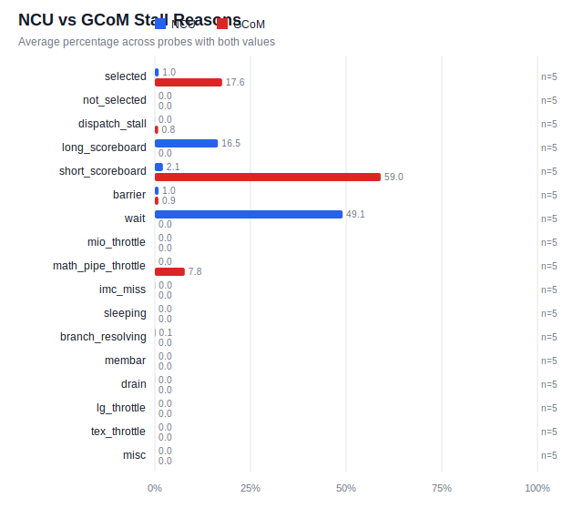

# gcom_cuda sim-vs-HW comparison: gcom_h100

- mapping version: `2026-07-gcom-cuda-v2`
- probes: 36 · with HW value: 20 · with sim value: 5
- categories: approximate=11, comparable=9, unavailable=16

## Validation anchors

- passed: 1 · failed: 3 · unavailable: 5 (tol 50%)
- broad comparison reliable: **False**

## Accuracy rollup (comparable probes)

| group | n | mean |pct err| | median |pct err| |
|---|---|---|---|
| Compute & Scheduling | 2 | 536.1% | 536.1% |
| Register, Tensor & Sync | 1 | 35.0% | 35.0% |

## Probe-level comparison

| probe | group | category | state | hw | sim | pct err | anchor |
|---|---|---|---|---|---|---|---|
| arithmetic_latency.dependent_chain | Compute & Scheduling | comparable | comparable | 4.377 | 10.92 | 149.5% | ✓ |
| arithmetic_throughput.independent_chains | Compute & Scheduling | comparable | comparable | 1.147 | 11.73 | 922.7% | ✓ |
| scheduler_policy.ready_warps | Compute & Scheduling | approximate | missing_stat | 16 | — | — |  |
| scheduler_policy.mixed_issue | Compute & Scheduling | unavailable | unsupported | single_issue_like | — | — |  |
| scheduler_policy.analyze | Compute & Scheduling | unavailable | not_applicable | (composite) | — | — |  |
| topology.device_attributes | Compute & Scheduling | unavailable | not_applicable | (composite) | — | — |  |
| topology.occupancy | Compute & Scheduling | unavailable | not_applicable | (composite) | — | — |  |
| topology.persistent_cta | Compute & Scheduling | approximate | missing_stat | 8 | — | — |  |
| register_file.register_bank_sweep | Register, Tensor & Sync | approximate | missing_stat | 16 | — | — |  |
| register_file.register_latency | Register, Tensor & Sync | approximate | missing_stat | 2.361 | — | — |  |
| register_file.analyze | Register, Tensor & Sync | unavailable | not_applicable | (composite) | — | — |  |
| tensor_core.mma_latency | Register, Tensor & Sync | comparable | comparable | 24.53 | 33.11 | 35.0% | ✓ |
| tensor_core.mma_throughput | Register, Tensor & Sync | approximate | approximate | 0.1589 | 2.553e-05 | 100.0% | ✓ |
| synchronization.barrier_latency | Register, Tensor & Sync | comparable | missing_stat | 45.27 | — | — | ✓ |
| synchronization.fence_latency | Register, Tensor & Sync | approximate | missing_stat | 929 | — | — |  |
| shared_memory.pointer_chase | On-chip Memory | comparable | missing_stat | 29.01 | — | — | ✓ |
| shared_memory.bank_stride | On-chip Memory | unavailable | unsupported | 32 | — | — |  |
| shared_memory.analyze | On-chip Memory | unavailable | not_applicable | (composite) | — | — |  |
| l1_cache.pointer_chase | On-chip Memory | comparable | missing_stat | 70.61 | — | — | ✓ |
| l1_cache.working_set | On-chip Memory | approximate | missing_stat | (composite) | — | — |  |
| l1_cache.conflict_sets | On-chip Memory | unavailable | unsupported | — | — | — |  |
| l1_cache.analyze | On-chip Memory | unavailable | not_applicable | (composite) | — | — |  |
| l2_cache.pointer_chase | On-chip Memory | comparable | missing_stat | 329.9 | — | — | ✓ |
| memory_pipeline.outstanding_requests | On-chip Memory | approximate | missing_stat | 4 | — | — |  |
| memory_pipeline.lane_patterns | On-chip Memory | unavailable | proxy_only | 32 | — | — |  |
| memory_pipeline.analyze | On-chip Memory | unavailable | not_applicable | (composite) | — | — |  |
| global_memory.streaming | Global Memory & DRAM | comparable | missing_stat | (composite) | — | — | ✓ |
| global_memory.partition_sweep | Global Memory & DRAM | unavailable | unsupported | balanced | — | — |  |
| global_memory.row_policy_sweep | Global Memory & DRAM | approximate | missing_stat | 1.755 | — | — |  |
| global_memory.analyze | Global Memory & DRAM | unavailable | not_applicable | (composite) | — | — |  |
| tma_copy.async_copy_latency | Transfer & Interconnect | approximate | approximate | 721.9 | 437.1 | 39.5% |  |
| tma_copy.tma_transfer_sweep | Transfer & Interconnect | approximate | missing_stat | 37.48 | — | — |  |
| tma_copy.analyze | Transfer & Interconnect | unavailable | not_applicable | (composite) | — | — |  |
| interconnect.injection_rate | Transfer & Interconnect | comparable | missing_stat | 3075 | — | — |  |
| interconnect.address_mapping | Transfer & Interconnect | unavailable | unsupported | uniform | — | — |  |
| interconnect.analyze | Transfer & Interconnect | unavailable | not_applicable | (composite) | — | — |  |

## GCoM stall-reason coverage

- complete histograms: 5
- partial histograms: 0
- no histogram: 31

## Stall-reason histogram comparison (NCU vs GCoM)

### All-Probe Stall Summary

| reason | probes | ncu avg pct | ncu | gcom avg pct | gcom | mean abs pp err | max abs pp err |
|---|---:|---:|---|---:|---|---:|---:|
| selected | 5 | 1.00 | .................. | 17.57 | ###............... | 16.57 | 35.82 |
| not_selected | 5 | 0.00 | .................. | 0.00 | .................. | 0.00 | 0.00 |
| dispatch_stall | 5 | 0.01 | .................. | 0.85 | .................. | 0.84 | 4.10 |
| warpgroup_arrive | 0 | — | — | — | — | — | — |
| long_scoreboard | 5 | 16.47 | ###............... | 0.00 | .................. | 16.47 | 62.68 |
| short_scoreboard | 5 | 2.09 | .................. | 59.03 | ###########....... | 56.94 | 84.44 |
| barrier | 5 | 0.97 | .................. | 0.92 | .................. | 0.05 | 0.23 |
| wait | 5 | 49.07 | #########......... | 0.00 | .................. | 49.07 | 80.81 |
| mio_throttle | 5 | 0.00 | .................. | 0.00 | .................. | 0.00 | 0.00 |
| math_pipe_throttle | 5 | 0.00 | .................. | 7.81 | #................. | 7.81 | 27.25 |
| mma | 0 | — | — | — | — | — | — |
| no_instructions | 0 | — | — | — | — | — | — |
| imc_miss | 5 | 0.05 | .................. | 0.00 | .................. | 0.05 | 0.09 |
| sleeping | 5 | 0.00 | .................. | 0.00 | .................. | 0.00 | 0.00 |
| branch_resolving | 5 | 0.12 | .................. | 0.00 | .................. | 0.12 | 0.46 |
| membar | 5 | 0.00 | .................. | 0.00 | .................. | 0.00 | 0.00 |
| drain | 5 | 0.01 | .................. | 0.00 | .................. | 0.01 | 0.03 |
| lg_throttle | 5 | 0.00 | .................. | 0.00 | .................. | 0.00 | 0.00 |
| tex_throttle | 5 | 0.00 | .................. | 0.00 | .................. | 0.00 | 0.00 |
| misc | 5 | 0.00 | .................. | 0.00 | .................. | 0.00 | 0.00 |

### arithmetic_latency.dependent_chain

- NCU histogram: yes
- GCoM histogram: yes · complete: True · denominator: 2.81e+06
- mean absolute error: 9.67 pp · max absolute error: 84.44 pp

| reason | ncu pct | gcom pct | abs pp err | gcom count |
|---|---|---|---|---|
| selected | 1.00 | 10.70 | 9.70 | 3.007e+05 |
| not_selected | 0.00 | 0.00 | 0.00 | 0 |
| dispatch_stall | 0.00 | 0.00 | 0.00 | 0 |
| warpgroup_arrive | — | 0.00 | — | 0 |
| long_scoreboard | 0.00 | 0.00 | 0.00 | 0 |
| short_scoreboard | 0.60 | 85.04 | 84.44 | 2.39e+06 |
| barrier | 0.00 | 0.00 | 0.00 | 0 |
| wait | 68.86 | 0.00 | 68.86 | 0 |
| mio_throttle | 0.00 | 0.00 | 0.00 | 0 |
| math_pipe_throttle | 0.00 | 1.20 | 1.20 | 3.374e+04 |
| mma | — | 0.00 | — | 0 |
| no_instructions | — | 3.37 | — | 9.459e+04 |
| imc_miss | 0.05 | 0.00 | 0.05 | 0 |
| sleeping | 0.00 | 0.00 | 0.00 | 0 |
| branch_resolving | 0.09 | 0.00 | 0.09 | 0 |
| membar | 0.00 | 0.00 | 0.00 | 0 |
| drain | 0.01 | 0.00 | 0.01 | 0 |
| lg_throttle | 0.00 | 0.00 | 0.00 | 0 |
| tex_throttle | 0.00 | 0.00 | 0.00 | 0 |
| misc | 0.00 | 0.00 | 0.00 | 0 |

### arithmetic_throughput.independent_chains

- NCU histogram: yes
- GCoM histogram: yes · complete: True · denominator: 6.017e+06
- mean absolute error: 7.28 pp · max absolute error: 56.50 pp

| reason | ncu pct | gcom pct | abs pp err | gcom count |
|---|---|---|---|---|
| selected | 1.00 | 36.82 | 35.82 | 2.215e+06 |
| not_selected | 0.00 | 0.00 | 0.00 | 0 |
| dispatch_stall | 0.00 | 0.01 | 0.01 | 384 |
| warpgroup_arrive | — | 0.00 | — | 0 |
| long_scoreboard | 0.00 | 0.00 | 0.00 | 0 |
| short_scoreboard | 0.50 | 57.00 | 56.50 | 3.43e+06 |
| barrier | 0.00 | 0.00 | 0.00 | 0 |
| wait | 4.09 | 0.00 | 4.09 | 0 |
| mio_throttle | 0.00 | 0.00 | 0.00 | 0 |
| math_pipe_throttle | 0.00 | 27.25 | 27.25 | 1.64e+06 |
| mma | — | 0.00 | — | 0 |
| no_instructions | — | 3.35 | — | 2.018e+05 |
| imc_miss | 0.01 | 0.00 | 0.01 | 0 |
| sleeping | 0.00 | 0.00 | 0.00 | 0 |
| branch_resolving | 0.02 | 0.00 | 0.02 | 0 |
| membar | 0.00 | 0.00 | 0.00 | 0 |
| drain | 0.00 | 0.00 | 0.00 | 0 |
| lg_throttle | 0.00 | 0.00 | 0.00 | 0 |
| tex_throttle | 0.00 | 0.00 | 0.00 | 0 |
| misc | 0.00 | 0.00 | 0.00 | 0 |

### memory_pipeline.outstanding_requests

- NCU histogram: yes
- GCoM histogram: no · complete: — · denominator: —
- mean absolute error: — pp · max absolute error: — pp

| reason | ncu pct | gcom pct | abs pp err | gcom count |
|---|---|---|---|---|
| selected | — | — | — | — |
| not_selected | 16.01 | — | — | — |
| dispatch_stall | — | — | — | — |
| warpgroup_arrive | — | — | — | — |
| long_scoreboard | 35.00 | — | — | — |
| short_scoreboard | 0.08 | — | — | — |
| barrier | 0.00 | — | — | — |
| wait | 20.43 | — | — | — |
| mio_throttle | 0.00 | — | — | — |
| math_pipe_throttle | 7.32 | — | — | — |
| mma | — | — | — | — |
| no_instructions | — | — | — | — |
| imc_miss | — | — | — | — |
| sleeping | — | — | — | — |
| branch_resolving | — | — | — | — |
| membar | — | — | — | — |
| drain | — | — | — | — |
| lg_throttle | 0.00 | — | — | — |
| tex_throttle | — | — | — | — |
| misc | — | — | — | — |

### scheduler_policy.mixed_issue

- NCU histogram: yes
- GCoM histogram: no · complete: — · denominator: —
- mean absolute error: — pp · max absolute error: — pp

| reason | ncu pct | gcom pct | abs pp err | gcom count |
|---|---|---|---|---|
| selected | — | — | — | — |
| not_selected | 10.52 | — | — | — |
| dispatch_stall | — | — | — | — |
| warpgroup_arrive | — | — | — | — |
| long_scoreboard | 0.00 | — | — | — |
| short_scoreboard | 0.98 | — | — | — |
| barrier | 0.00 | — | — | — |
| wait | 34.99 | — | — | — |
| mio_throttle | 0.00 | — | — | — |
| math_pipe_throttle | 4.20 | — | — | — |
| mma | — | — | — | — |
| no_instructions | — | — | — | — |
| imc_miss | — | — | — | — |
| sleeping | — | — | — | — |
| branch_resolving | — | — | — | — |
| membar | — | — | — | — |
| drain | — | — | — | — |
| lg_throttle | 0.00 | — | — | — |
| tex_throttle | — | — | — | — |
| misc | — | — | — | — |

### scheduler_policy.ready_warps

- NCU histogram: yes
- GCoM histogram: no · complete: — · denominator: —
- mean absolute error: — pp · max absolute error: — pp

| reason | ncu pct | gcom pct | abs pp err | gcom count |
|---|---|---|---|---|
| selected | — | — | — | — |
| not_selected | 1.47 | — | — | — |
| dispatch_stall | — | — | — | — |
| warpgroup_arrive | — | — | — | — |
| long_scoreboard | 0.00 | — | — | — |
| short_scoreboard | 3.34 | — | — | — |
| barrier | 0.00 | — | — | — |
| wait | 38.77 | — | — | — |
| mio_throttle | 0.10 | — | — | — |
| math_pipe_throttle | 1.03 | — | — | — |
| mma | — | — | — | — |
| no_instructions | — | — | — | — |
| imc_miss | — | — | — | — |
| sleeping | — | — | — | — |
| branch_resolving | — | — | — | — |
| membar | — | — | — | — |
| drain | — | — | — | — |
| lg_throttle | 0.00 | — | — | — |
| tex_throttle | — | — | — | — |
| misc | — | — | — | — |

### tensor_core.mma_latency

- NCU histogram: yes
- GCoM histogram: yes · complete: True · denominator: 5.134e+05
- mean absolute error: 7.00 pp · max absolute error: 80.81 pp

| reason | ncu pct | gcom pct | abs pp err | gcom count |
|---|---|---|---|---|
| selected | 1.00 | 10.13 | 9.13 | 5.201e+04 |
| not_selected | 0.00 | 0.00 | 0.00 | 0 |
| dispatch_stall | 0.00 | 0.02 | 0.02 | 99 |
| warpgroup_arrive | — | 22.49 | — | 1.155e+05 |
| long_scoreboard | 4.50 | 0.00 | 4.50 | 0 |
| short_scoreboard | 1.12 | 25.38 | 24.26 | 1.303e+05 |
| barrier | 0.00 | 0.00 | 0.00 | 0 |
| wait | 80.81 | 0.00 | 80.81 | 0 |
| mio_throttle | 0.00 | 0.00 | 0.00 | 0 |
| math_pipe_throttle | 0.00 | 0.12 | 0.12 | 596 |
| mma | — | 7.18 | — | 3.685e+04 |
| no_instructions | — | 58.95 | — | 3.026e+05 |
| imc_miss | 0.06 | 0.00 | 0.06 | 0 |
| sleeping | 0.00 | 0.00 | 0.00 | 0 |
| branch_resolving | 0.01 | 0.00 | 0.01 | 0 |
| membar | 0.00 | 0.00 | 0.00 | 0 |
| drain | 0.03 | 0.00 | 0.03 | 0 |
| lg_throttle | 0.00 | 0.00 | 0.00 | 0 |
| tex_throttle | 0.00 | 0.00 | 0.00 | 0 |
| misc | 0.00 | 0.00 | 0.00 | 0 |

### tensor_core.mma_throughput

- NCU histogram: yes
- GCoM histogram: yes · complete: True · denominator: 5.932e+05
- mean absolute error: 9.52 pp · max absolute error: 75.40 pp

| reason | ncu pct | gcom pct | abs pp err | gcom count |
|---|---|---|---|---|
| selected | 1.00 | 12.13 | 11.13 | 7.194e+04 |
| not_selected | 0.00 | 0.00 | 0.00 | 0 |
| dispatch_stall | 0.01 | 0.07 | 0.06 | 396 |
| warpgroup_arrive | — | 49.68 | — | 2.947e+05 |
| long_scoreboard | 15.19 | 0.00 | 15.19 | 0 |
| short_scoreboard | 0.48 | 60.21 | 59.73 | 3.572e+05 |
| barrier | 0.00 | 0.00 | 0.00 | 0 |
| wait | 75.40 | 0.00 | 75.40 | 0 |
| mio_throttle | 0.00 | 0.00 | 0.00 | 0 |
| math_pipe_throttle | 0.00 | 0.18 | 0.18 | 1056 |
| mma | — | 5.52 | — | 3.275e+04 |
| no_instructions | — | 27.10 | — | 1.608e+05 |
| imc_miss | 0.09 | 0.00 | 0.09 | 0 |
| sleeping | 0.00 | 0.00 | 0.00 | 0 |
| branch_resolving | 0.01 | 0.00 | 0.01 | 0 |
| membar | 0.00 | 0.00 | 0.00 | 0 |
| drain | 0.03 | 0.00 | 0.03 | 0 |
| lg_throttle | 0.00 | 0.00 | 0.00 | 0 |
| tex_throttle | 0.00 | 0.00 | 0.00 | 0 |
| misc | 0.00 | 0.00 | 0.00 | 0 |

### tma_copy.async_copy_latency

- NCU histogram: yes
- GCoM histogram: yes · complete: True · denominator: 3.497e+06
- mean absolute error: 10.05 pp · max absolute error: 62.68 pp

| reason | ncu pct | gcom pct | abs pp err | gcom count |
|---|---|---|---|---|
| selected | 1.00 | 18.05 | 17.05 | 6.313e+05 |
| not_selected | 0.00 | 0.00 | 0.00 | 0 |
| dispatch_stall | 0.05 | 4.15 | 4.10 | 1.45e+05 |
| warpgroup_arrive | — | 0.00 | — | 0 |
| long_scoreboard | 62.68 | 0.00 | 62.68 | 0 |
| short_scoreboard | 7.75 | 67.53 | 59.78 | 2.362e+06 |
| barrier | 4.85 | 4.62 | 0.23 | 1.615e+05 |
| wait | 16.21 | 0.00 | 16.21 | 0 |
| mio_throttle | 0.00 | 0.00 | 0.00 | 0 |
| math_pipe_throttle | 0.00 | 10.32 | 10.32 | 3.608e+05 |
| mma | — | 0.00 | — | 0 |
| no_instructions | — | 2.19 | — | 7.644e+04 |
| imc_miss | 0.03 | 0.00 | 0.03 | 0 |
| sleeping | 0.00 | 0.00 | 0.00 | 0 |
| branch_resolving | 0.46 | 0.00 | 0.46 | 0 |
| membar | 0.00 | 0.00 | 0.00 | 0 |
| drain | 0.00 | 0.00 | 0.00 | 0 |
| lg_throttle | 0.00 | 0.00 | 0.00 | 0 |
| tex_throttle | 0.00 | 0.00 | 0.00 | 0 |
| misc | 0.00 | 0.00 | 0.00 | 0 |

## Non-stall counter comparison (GCoM-derived vs NCU)

| probe | logical | fidelity | hw ncu | sim gcom | pct err |
|---|---|---|---|---|---|
| arithmetic_latency.dependent_chain | dram_throughput | proportional | — | 2.1e-05 | — |
| arithmetic_latency.dependent_chain | inst_executed | direct | 4626 | 3.147e+05 | 6702.1% |
| arithmetic_latency.dependent_chain | interconnect_latency | proxy | — | 582 | — |
| arithmetic_latency.dependent_chain | l2_hit_rate | proportional | — | 0.52 | — |
| arithmetic_latency.dependent_chain | l2_sector_hits | proportional | 4.52e+04 | 7.66e+04 | 69.5% |
| arithmetic_latency.dependent_chain | sm_active_cycles | direct | 140.6 | 4.473e+04 | 31727.8% |
| arithmetic_throughput.independent_chains | dram_throughput | proportional | — | 0.000407 | — |
| arithmetic_throughput.independent_chains | inst_executed | direct | 1.108e+06 | 7.089e+07 | 6299.6% |
| arithmetic_throughput.independent_chains | interconnect_latency | proxy | — | 94 | — |
| arithmetic_throughput.independent_chains | l2_hit_rate | proportional | — | 0.9357 | — |
| arithmetic_throughput.independent_chains | l2_sector_hits | proportional | 4.588e+04 | 5.936e+04 | 29.4% |
| arithmetic_throughput.independent_chains | sm_active_cycles | direct | 2361 | 4.805e+04 | 1935.3% |
| tensor_core.mma_latency | dram_throughput | proportional | — | 5.1e-05 | — |
| tensor_core.mma_latency | inst_executed | direct | 1576 | 1.659e+06 | 105173.4% |
| tensor_core.mma_latency | interconnect_latency | proxy | — | 23 | — |
| tensor_core.mma_latency | l2_hit_rate | proportional | — | 0.4811 | — |
| tensor_core.mma_latency | l2_sector_hits | proportional | 4.944e+04 | 1.42e+04 | 71.3% |
| tensor_core.mma_latency | sm_active_cycles | direct | 108.9 | 1.695e+04 | 15471.8% |
| tensor_core.mma_throughput | dram_throughput | proportional | — | 7e-05 | — |
| tensor_core.mma_throughput | inst_executed | direct | 2180 | 2.285e+06 | 104731.0% |
| tensor_core.mma_throughput | interconnect_latency | proxy | — | 23 | — |
| tensor_core.mma_throughput | l2_hit_rate | proportional | — | 0.5526 | — |
| tensor_core.mma_throughput | l2_sector_hits | proportional | 4.555e+04 | 6444 | 85.9% |
| tensor_core.mma_throughput | sm_active_cycles | direct | 63.28 | 6264 | 9798.9% |
| tma_copy.async_copy_latency | dram_throughput | proportional | — | 0.000199 | — |
| tma_copy.async_copy_latency | inst_executed | direct | 1.913e+04 | 1.53e+07 | 79902.9% |
| tma_copy.async_copy_latency | interconnect_latency | proxy | — | 2 | — |
| tma_copy.async_copy_latency | l2_hit_rate | proportional | — | 0.4808 | — |
| tma_copy.async_copy_latency | l2_sector_hits | proportional | 4.61e+04 | 1.481e+05 | 221.3% |
| tma_copy.async_copy_latency | sm_active_cycles | direct | 616.1 | 2.797e+04 | 4440.2% |
